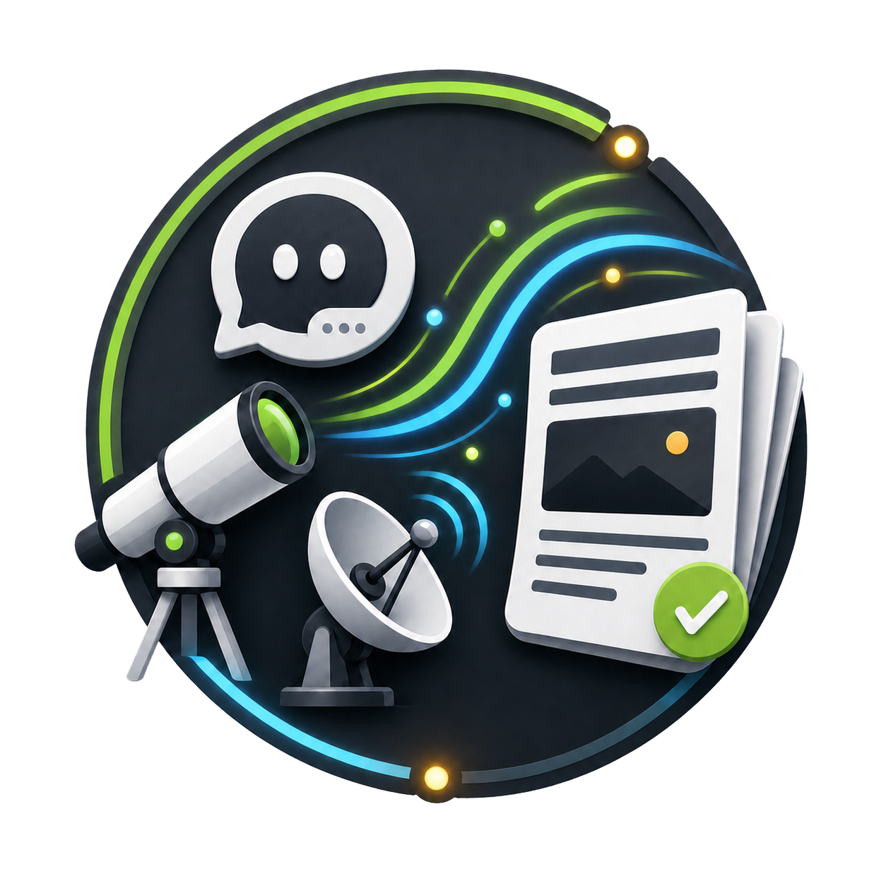
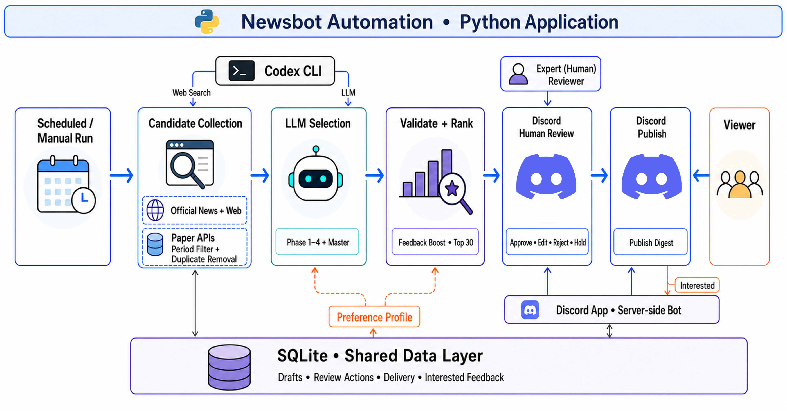
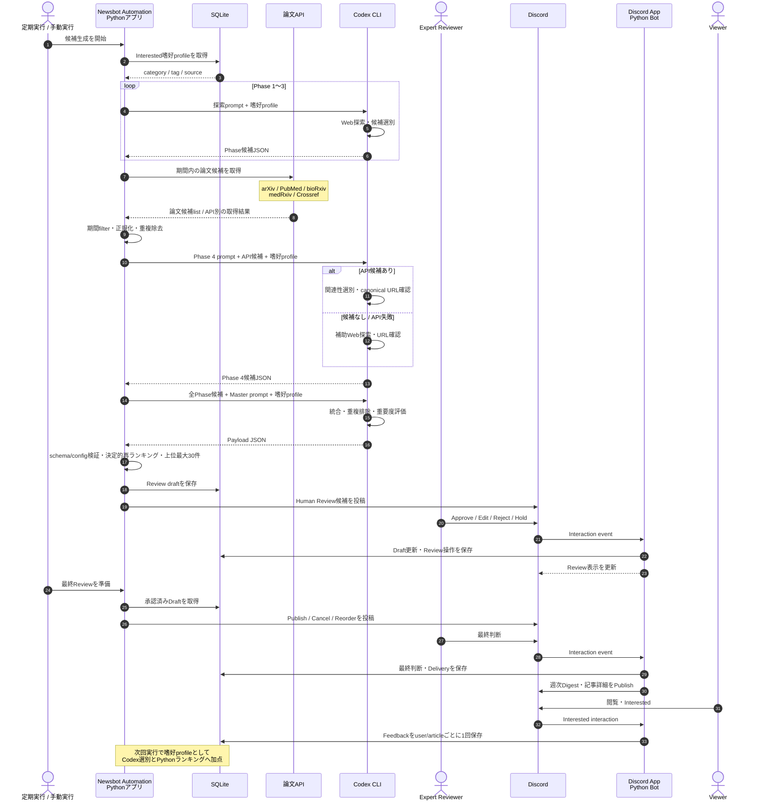

# Newsbot Automation

<p align="center">
  
</p>

Newsbot Automation は、Codex CLI でトピック別ニュースを収集し、Discord Bot 上で人間がレビューし、最終承認後に週次ダイジェストとして公開するための Python アプリです。

English documentation is available in [README.md](README.md).

## Architecture



Codex CLI がトピックに沿ったニュースを収集して payload JSON を作成し、Newsbot が検証・ランキングしたうえで SQLite にレビュー下書きと操作履歴を保存します。Discord のレビューチャンネルではボタンやモーダルで人間が確認し、最終承認後だけ公開チャンネルへ週次ダイジェストを投稿します。公開後の `Interested` フィードバックは、次回以降のランキングに反映されます。

<details>
<summary><strong>候補収集・選別・Feedbackの詳細（クリックして展開）</strong></summary>



Newsbot Automation本体はPythonアプリで、処理全体のオーケストレーション、論文API取得・前処理、検証・ランキング、Discord App、SQLite連携を担います。候補収集のWeb探索とPhase 1〜4・MasterのLLM選別では、このPythonアプリからCodex CLIを呼び出します。

論文探索では、Python がAPI候補を取得して期間filterと重複除去を行い、そのリストを主入力として Codex CLIのPhase 4 LLMが選別します。ここでの重複除去とは、同じ論文が複数API、preprint、出版社版などから重ねて取得された場合に、DOIやURLを使って1候補へまとめる処理です。APIが失敗した場合や候補がない場合は、LLMが補助的にWeb検索します。各Phaseの候補はCodex CLIのMaster LLMが統合し、その後Pythonが同じFeedback傾向を使って再ランキングします。

公開記事の `Interested` は、同じtopic・cadenceの過去記事からカテゴリ・タグ・ソース別の嗜好profileに集約されます。このprofileは次回のLLM選別とPythonランキングの両方へ渡されます。現在は正評価だけを扱うため、Feedbackは確率的な抽選や負評価による減点ではなく、類似候補を相対的に上位へ移す加点信号です。

</details>

## Prompt Templates

このリポジトリは複数topicを扱える実行基盤ですが、現在の詳細なmulti-phase workflowは`lab_automation`に特化しています。[prompts/lab_automation/](prompts/lab_automation/)は、探索範囲、除外条件、source方針、Phase分割、論文API候補のLLM選別、重複排除、Feedbackの扱い、JSON出力契約を具体化した、実用的な参考実装です。別分野へ展開するときは、この構成をprompt設計の例として参照してください。

promptの使い分けは次のとおりです。

- `prompts/lab_automation/phase_1_*.md`〜`phase_4_*.md`と`master_builder.md`: 通常の`lab_automation`実行で使用する4 Phase + Master構成。
- `prompts/lab_automation.md`: `--topic lab_automation --single-agent`で使用する単一promptのfallback例。
- `prompts/stock_news.md`: 通常のtop-level単一prompt例。
- `prompts/<topic>.md`がないtopic: Python内蔵の汎用promptを使用。

新しいtopicを単一prompt方式で追加する場合は、`config/newsbot.config.json`へtopic・cadence・destinationを追加し、`prompts/<topic>.md`を作成します。`{{TOPIC}}`、`{{CADENCE}}`、`{{PERIOD}}`などのruntime placeholderと、Newsbot payloadのJSON契約は維持してください。

現在、directoryをコピーして名前を変えるだけでは、新しいtopicでmulti-phase workflowや論文API連携は有効になりません。この分岐は`scripts/generate_payload_openai.py`で`lab_automation`に明示的に限定されているため、別topicでも同じ構成を使う場合はPhase定義と実行分岐のコード拡張が必要です。

## Install

<details>
<summary><strong>Local Install（クリックして展開）</strong></summary>

### 1. Python環境を作る

`venv` の場合:

```bash
python -m venv .venv
. .venv/bin/activate
python -m pip install -e .
```

Conda の場合:

```bash
conda env create -f environment.yml
conda activate newsbot
python -m pip install -e .
```

### 2. Codex CLIをインストールしてログインする

```bash
npm install -g @openai/codex
codex login --device-auth
codex exec --ephemeral "Say OK"
```

最新の手順は OpenAI 公式ドキュメントも確認してください。

- [Codex CLI getting started](https://help.openai.com/en/articles/11096431)
- [Codex CLI sign in with ChatGPT](https://help.openai.com/en/articles/11381614-api-codex-cli-and-sign-in-with-chatgpt)

### 3. Discord設定を書く

`.env.example` を `.env` にコピーし、少なくとも以下を設定します。

```bash
install -m 600 .env.example .env
```

```dotenv
DISCORD_BOT_TOKEN=
DISCORD_REVIEW_CHANNEL_ID=
DISCORD_PUBLISH_CHANNEL_ID=
DISCORD_REVIEWER_USER_IDS=
DISCORD_ALLOWED_GUILD_ID=
NEWSBOT_NCBI_TOOL=newsbot_automation
NEWSBOT_NCBI_EMAIL=
NEWSBOT_CROSSREF_MAILTO=
```

`DISCORD_REVIEWER_USER_IDS` は、Reviewer 操作を許可する Discord user ID のカンマ区切りです。`DISCORD_ALLOWED_GUILD_ID` は任意ですが、公開・共有環境では設定を推奨します。

PubMedを使う前に、NCBIへ登録済みのtool/emailを設定してください。
`NCBI_API_KEY`は任意でCodexには渡しません。Crossref polite poolのため
連絡先emailの設定を推奨します。

### 4. DB初期化とBot起動

```bash
python -m newsbot.cli init-db
python -m newsbot.cli run-discord-bot
```

Discord のボタンやModal操作を受け付けるため、Bot は起動したままにします。

### 5. Codex CLIでReview候補を作る

別ターミナルで実行します。

```bash
python scripts/generate_payload_openai.py --topic lab_automation --submit-review
```

Codex CLI が最近のニュースを検索し、`payloads/` にpayloadを保存し、検証後に最大30件の候補をReviewerチャンネルへ投稿します。

### 6. 最終レビューと公開

1st screening で `Approve Weekly` した記事がある場合:

```bash
python -m newsbot.cli prepare-weekly-publish
```

Reviewer は各候補に対して `Publish`、`Edit Draft`、`Cancel` を選びます。全件の判断が揃うと、Bot が `Reorder` と `Publish Digest` 付きの最終一覧を投稿します。実際の公開は Reviewer が `Publish Digest` を押したときだけ行われます。

全件判断済みなのに最終一覧が出ていない場合は、`prepare-weekly-publish` をもう一度実行してください。選択済みの記事をfinal reviewへ戻さず、`Reorder` / `Publish Digest` 付きの最終一覧だけを再投稿します。

### 7. Botをsystemdで常駐・自動起動する

Linuxでは付属のinstallerを使うと、Discord Botをsystemdへ登録し、その場で起動すると同時にOS起動時の自動起動を有効化できます。

`venv`を使用し、専用の`newsbot`ユーザーで動かす例:

```bash
sudo scripts/install_systemd_service.sh \
  --env venv \
  --app-dir /opt/newsbot-automation \
  --user newsbot \
  --group newsbot
sudo systemctl status newsbot-discord-bot
```

Condaの場合は`--env conda --python-bin /absolute/path/to/python`を指定します。実行ユーザーには、リポジトリとPythonへのアクセス権、およびCodex CLIの認証が必要です。installerは内部で`systemctl enable --now`を実行します。詳細は[Linux deployment and systemd setup](docs/linux-deployment.md)を参照してください。

</details>

<details>
<summary><strong>Docker Install（クリックして展開）</strong></summary>

ローカルのvenv・Conda方式を変更せず、Docker Composeでも実行できます。

```bash
install -m 600 .env.example .env
docker compose build
docker compose run --rm codex-login
docker compose run --rm init-db
docker compose up -d discord-bot
```

単発でReview候補を生成する場合:

```bash
docker compose run --rm generate-review
```

container内schedulerを使用する場合:

```bash
docker compose --profile scheduler up -d
```

SQLite、payload、log、Codex CLI認証はnamed volumeへ永続化されます。設定・更新・停止方法は[Docker Compose Install 日本語ガイド](docs/docker-install.ja.md)を参照してください。

### PC起動時に自動起動する

LinuxではDocker Engine自体を自動起動にし、Compose serviceを一度作成しておきます。

```bash
sudo systemctl enable --now containerd.service docker.service
docker compose up -d discord-bot
```

container内schedulerも使う場合:

```bash
docker compose --profile scheduler up -d
```

`discord-bot`と`scheduler`には`restart: unless-stopped`が設定されているため、作成済みcontainerはDocker Engine起動後に自動復帰します。自動起動を維持する場合は`docker compose down`でcontainerを削除しないでください。`stop`後や`down`後は、上記の`up -d`をもう一度実行します。

Docker Desktopでは設定画面の「Start Docker Desktop when you sign in to your computer」も有効にしてください。詳細と注意点は[Docker Compose Install 日本語ガイド](docs/docker-install.ja.md#7-pc起動時の自動起動)を参照してください。

</details>

## cron設定

cron は helper script で `/etc/cron.d/newsbot-automation` にインストールできます。

```bash
sudo scripts/install_cron_jobs.sh --app-dir /opt/newsbot-automation --user newsbot
```

デフォルトでは、Review候補生成は毎朝 08:00 JST に起動し、前回成功から2日以上経っている場合だけ実行します。週次の最終レビュー準備は毎週月曜 08:00 JST に実行します。

`.env` で実行ユーザー、Python、スケジュールを変更できます。

```dotenv
NEWSBOT_CRON_USER=newsbot
NEWSBOT_CRON_TZ=Asia/Tokyo
NEWSBOT_PYTHON_BIN=/opt/newsbot-automation/.venv/bin/python
NEWSBOT_GENERATE_REVIEW_CRON="0 8 * * *"
NEWSBOT_GENERATE_REVIEW_EVERY_DAYS=2
NEWSBOT_GENERATE_REVIEW_TOPIC=lab_automation
NEWSBOT_GENERATE_REVIEW_CADENCE=weekly
NEWSBOT_PREPARE_WEEKLY_CRON="0 8 * * 1"
NEWSBOT_DISCORD_MESSAGE_INTERVAL_SECONDS=1
NEWSBOT_CODEX_BIN=/path/to/codex
```

cron で `codex` が見つからない場合は、`NEWSBOT_CODEX_BIN` に絶対パスを指定します。`NEWSBOT_LOOKBACK_DAYS` が空の場合、前回成功実行時から今回実行時までを検索します。Discord の rate limit が出る場合は、`NEWSBOT_DISCORD_MESSAGE_INTERVAL_SECONDS` を `2` などに上げてください。

## Documentation

- [Full HowTo 日本語](docs/howto.ja.md)
- [テスト手順](docs/testing-guide.ja.md)
- [Discord review workflow](docs/discord-review-workflow.md)
- [Docker Compose Install 日本語ガイド](docs/docker-install.ja.md)
- [Linux deployment and systemd setup](docs/linux-deployment.md)
- [Security policy](SECURITY.md)
- [GitHub公開前チェックリスト](docs/public-release.ja.md)
- [Contributing](CONTRIBUTING.md)
- [Changelog](CHANGELOG.md)
- [Legal Notices](docs/legal-notices.md)

## Verification

公開前に以下を実行してください。

```bash
python scripts/private_repo_check.py
python -m compileall newsbot tests scripts
python -m unittest discover -s tests
```

## Advanced / Legacy Features

旧 `notify` フローでは、`.env.example` の `DISCORD_WEBHOOK_URL` や X 関連credentialを使った通知も残っています。ただし、公開版で推奨する主導線は Discord Bot + Codex CLI のレビューパイプラインです。

## License・Legal Notice

Newsbot Automationのソースコードは[MIT License](LICENSE)で公開します。外部APIのデータや商標には、それぞれの規約が適用されます。PubMedを使う運用者は、NCBIへ登録済みのtool/emailを設定し、rate limitを守る必要があります。詳細は[Legal Notices](docs/legal-notices.md)を参照してください。
