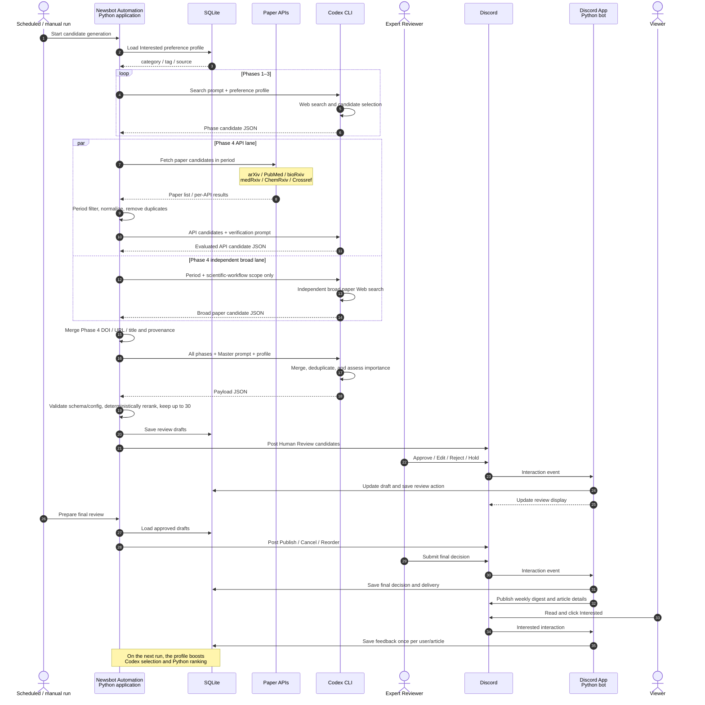

# Newsbot Automation

<p align="center">
  
</p>

Newsbot Automation is a Python + Discord workflow for collecting topic-based news with Codex CLI, reviewing drafts with a Discord bot, and publishing a weekly digest only after human approval.

Japanese documentation is available in [README.ja.md](README.ja.md).

## Architecture


The pipeline starts with Codex CLI collecting topic-scoped news and producing a payload JSON. Newsbot validates and ranks those items, stores review drafts and reviewer actions in SQLite, posts interactive review cards to Discord, and publishes a final digest only after reviewer approval. Published messages can collect `Interested` feedback, which feeds future ranking.

<details>
<summary><strong>Candidate collection, selection, and feedback details (click to expand)</strong></summary>



Newsbot Automation itself is a Python application. It orchestrates the workflow and implements paper API retrieval and preprocessing, validation and ranking, the Discord App, and SQLite integration. The Python application invokes Codex CLI for candidate-collection Web searches and for the Phase 1–4 and Master LLM selection steps.

For paper discovery, Python retrieves API candidates, filters them to the requested period, and removes duplicates. arXiv, PubMed, bioRxiv, medRxiv, ChemRxiv, and Crossref candidates receive a shared high-recall semantic prefilter before Phase 4 LLM review; rejected prefilter candidates and source-level counts are retained in the Phase 4 audit artifacts. ChemRxiv uses Crossref `posted-content` as its sole machine-readable metadata route, filters locally for both current `10.26434/chemrxiv.` and legacy `10.26434/chemrxiv-` DOIs, and merges `/vN`, `-vN`, and `.vN` versions at the work level. Crossref uses the documented public or polite pool limits and honors `Retry-After`. Phase 4 runs its batched API-review lane and an API-blind broad Web-search lane concurrently, then merges DOI, canonical URL, normalized title, and `api`/`broad` provenance. Phase 4 also covers programmable experimental environments, scientific digital twins, and AI Scientist evaluation environments when they model concrete scientific experiment actions, state, observations, resources, replay, or audit. Phase 1 through Phase 3 run structured and broad discovery as two parallel, isolated Codex sessions. RSS/Atom/sitemap candidates enter only the structured session, then Python merges canonical URLs, duplicate keys, normalized titles, and discovery provenance. Phase 1–5 have no fixed candidate-output ceiling; only the Master/reviewer stage applies the configured final limit. Each failed lane is retried once; one successful lane is sufficient. Retry prompts, logs, events, and usage are retained per attempt, and malformed broad-query counts are recovered from actual Codex Web-search events when possible. Phase 5 remains independent of same-run Phase 1–4 output. The Master merges all five phases.

`Interested` remains a separate reader signal. Editorial accept/exclude/cancel/missed decisions require a reason code and are aggregated over `NEWSBOT_FEEDBACK_LOOKBACK_WEEKS` (default 12). Missed organizations/domains become a temporary dynamic watchlist; negative feedback informs LLM judgment but never becomes an automatic hard exclusion. Every run stores candidate provenance and a hashed feedback audit window. Event dates are stored separately from canonical publication dates, and important events render under an `Events` section in the weekly digest.

Administrators listed in `DISCORD_REVIEWER_USER_IDS` can register a search miss with only `/newsbot_record_missed url:<URL>`. Newsbot asks Codex to verify the page and related primary evidence, derive canonical metadata and its phase, and writes a `search_miss` judgment only when a concrete Lab Automation connection is verified. The response is ephemeral. Configure this investigation separately with `NEWSBOT_MISSED_ITEM_MODEL`, `NEWSBOT_MISSED_ITEM_REASONING_EFFORT`, and `NEWSBOT_MISSED_ITEM_TIMEOUT_SECONDS`.

</details>

## Prompt Templates

The runtime supports multiple topics, but the detailed multi-phase workflow currently specializes in `lab_automation`. [prompts/lab_automation/](prompts/lab_automation/) is a practical reference implementation: it demonstrates how to define search scope, exclusions, source policy, phase responsibilities, LLM selection over paper API candidates, deduplication, feedback handling, and the JSON output contract. Use this structure as a prompt-design example when adapting Newsbot to another field.

The templates are selected as follows:

- `prompts/lab_automation/phase_1_*.md` through `phase_5_*.md` plus `master_builder.md`: the normal five-phase and Master workflow for `lab_automation`.
- `prompts/lab_automation.md`: the single-prompt fallback used with `--topic lab_automation --single-agent`.
- `prompts/stock_news.md`: an example of the normal top-level single-prompt workflow.
- A topic without `prompts/<topic>.md`: the generic prompt built into Python.

To add a topic with the single-prompt workflow, add its topic, cadence, and destination to `config/newsbot.config.json`, then create `prompts/<topic>.md`. Preserve runtime placeholders such as `{{TOPIC}}`, `{{CADENCE}}`, and `{{PERIOD}}`, together with the Newsbot payload JSON contract.

Copying and renaming the directory alone does not enable the multi-phase workflow or paper API integration for another topic. The execution branch in `scripts/generate_payload_openai.py` explicitly limits that workflow to `lab_automation`; supporting another multi-phase topic also requires extending the phase definitions and execution routing in Python.

## Install

<details>
<summary><strong>Local Install (click to expand)</strong></summary>

### 1. Create a Python environment

Use either `venv`:

```bash
python -m venv .venv
. .venv/bin/activate
python -m pip install -e .
```

Or Conda:

```bash
conda env create -f environment.yml
conda activate newsbot
python -m pip install -e .
```

### 2. Install and sign in to Codex CLI

Install Codex CLI and sign in:

```bash
npm install -g @openai/codex
codex login --device-auth
codex exec --ephemeral "Say OK"
```

See OpenAI's Codex CLI guides for the latest setup details:

- [Codex CLI getting started](https://help.openai.com/en/articles/11096431)
- [Codex CLI sign in with ChatGPT](https://help.openai.com/en/articles/11381614-api-codex-cli-and-sign-in-with-chatgpt)

### 3. Configure Discord

Copy `.env.example` to `.env` and set at least:

```bash
install -m 600 .env.example .env
```

```dotenv
DISCORD_BOT_TOKEN=
DISCORD_REVIEW_CHANNEL_ID=
DISCORD_PUBLISH_CHANNEL_ID=
DISCORD_REVIEWER_USER_IDS=
DISCORD_ALLOWED_GUILD_ID=
NEWSBOT_MISSED_ITEM_MODEL=gpt-5.6-luna
NEWSBOT_MISSED_ITEM_REASONING_EFFORT=high
NEWSBOT_NCBI_TOOL=newsbot_automation
NEWSBOT_NCBI_EMAIL=
NEWSBOT_CROSSREF_MAILTO=
```

`DISCORD_REVIEWER_USER_IDS` is a comma-separated list of Discord user IDs allowed to operate reviewer buttons. `DISCORD_ALLOWED_GUILD_ID` is optional but recommended for public or shared bot deployments.

Set registered NCBI tool/email values before using PubMed. `NCBI_API_KEY` is
optional and is never passed to Codex; Crossref recommends a contact email for
its polite API pool.

### 4. Initialize and run

```bash
python -m newsbot.cli init-db
python -m newsbot.cli run-discord-bot
```

Keep the bot running while reviewers use Discord buttons and modals.

### 5. Generate review candidates

In another terminal:

```bash
python scripts/generate_payload_openai.py --topic lab_automation --submit-review
```

This asks Codex CLI to search recent news, writes a payload under `payloads/`, validates it, and posts up to 30 ranked drafts to the reviewer Discord channel.

### 6. Final weekly review and publish

After reviewers click `Approve Weekly` during first screening:

```bash
python -m newsbot.cli prepare-weekly-publish
```

Reviewers then choose `Publish`, `Edit Draft`, or `Cancel` for each final candidate. After all candidates are decided, the bot posts a final digest preview with `Reorder` and `Publish Digest`. Public publishing happens only when a reviewer clicks `Publish Digest`.

If all candidates have already been decided but the final digest preview is missing, run `prepare-weekly-publish` again. It will repost the `Reorder` / `Publish Digest` preview without moving selected items back to final review.

### 7. Keep the Bot running with systemd

On Linux, the included installer registers the Discord Bot with systemd, starts it immediately, and enables it automatically at OS boot.

Example using `venv` and a dedicated `newsbot` user:

```bash
sudo scripts/install_systemd_service.sh \
  --env venv \
  --app-dir /opt/newsbot-automation \
  --user newsbot \
  --group newsbot
sudo systemctl status newsbot-discord-bot
```

For Conda, specify `--env conda --python-bin /absolute/path/to/python`. The runtime user must be able to access the repository and Python installation and must have authenticated Codex CLI. The installer runs `systemctl enable --now` internally. See [Linux deployment and systemd setup](docs/linux-deployment.md) for the complete procedure.

</details>

<details>
<summary><strong>Docker Install (click to expand)</strong></summary>

Docker Compose can run Newsbot without changing the local venv or Conda workflow:

```bash
install -m 600 .env.example .env
docker compose build
docker compose run --rm codex-login
docker compose run --rm init-db
docker compose up -d discord-bot
```

Generate review candidates as a one-off job:

```bash
docker compose run --rm generate-review
```

Optionally run the schedules inside a container:

```bash
docker compose --profile scheduler up -d
```

SQLite, payloads, logs, and Codex CLI authentication are persisted in named volumes. See the [Docker Compose Install guide](docs/docker-install.md) for configuration, upgrade, and shutdown details.

### Start automatically when the computer boots

On Linux, enable Docker Engine at boot and create the Compose service once:

```bash
sudo systemctl enable --now containerd.service docker.service
docker compose up -d discord-bot
```

If the container scheduler is also required:

```bash
docker compose --profile scheduler up -d
```

Both `discord-bot` and `scheduler` use `restart: unless-stopped`, so existing containers restart after Docker Engine starts. Do not remove them with `docker compose down` if boot-time restart should remain active. After `stop` or `down`, run the appropriate `up -d` command again.

With Docker Desktop, also enable “Start Docker Desktop when you sign in to your computer.” See the [Docker Compose Install guide](docs/docker-install.md#7-start-automatically-when-the-computer-boots) for details and limitations.

</details>

## Cron Setup

Install cron jobs into `/etc/cron.d/newsbot-automation` with the helper script:

```bash
sudo scripts/install_cron_jobs.sh --app-dir /opt/newsbot-automation --user newsbot
```

By default, review generation is triggered at 08:00 JST every day and runs only when the last successful run is at least 2 days old. Weekly final-review preparation runs every Monday at 08:00 JST.

Set the runtime user, Python binary, and schedules in `.env`:

```dotenv
NEWSBOT_CRON_USER=newsbot
NEWSBOT_CRON_TZ=Asia/Tokyo
NEWSBOT_PYTHON_BIN=/opt/newsbot-automation/.venv/bin/python
NEWSBOT_GENERATE_REVIEW_CRON="0 8 * * *"
NEWSBOT_GENERATE_REVIEW_EVERY_DAYS=2
NEWSBOT_GENERATE_REVIEW_TOPIC=lab_automation
NEWSBOT_GENERATE_REVIEW_CADENCE=weekly
NEWSBOT_PREPARE_WEEKLY_CRON="0 8 * * 1"
NEWSBOT_DISCORD_MESSAGE_INTERVAL_SECONDS=1
NEWSBOT_CODEX_BIN=/path/to/codex
```

If cron cannot find `codex`, set an absolute path in `NEWSBOT_CODEX_BIN`. When `NEWSBOT_LOOKBACK_DAYS` is blank, the generator searches from the previous successful run. If Discord rate limits still appear, raise `NEWSBOT_DISCORD_MESSAGE_INTERVAL_SECONDS` to `2` or higher.

## Documentation

- [Full HowTo](docs/howto.md)
- [Manual and automated testing guide](docs/testing-guide.md)
- [Discord review workflow](docs/discord-review-workflow.md)
- [Docker Compose Install](docs/docker-install.md)
- [Linux deployment and systemd setup](docs/linux-deployment.md)
- [Security policy](SECURITY.md)
- [Public release checklist](docs/public-release.md)
- [Contributing](CONTRIBUTING.md)
- [Changelog](CHANGELOG.md)
- [Legal Notices](docs/legal-notices.md)

## Verification

Run these before publishing changes:

```bash
python scripts/private_repo_check.py
python -m compileall newsbot tests scripts
python -m unittest discover -s tests
```

## Advanced / Legacy Features

The legacy `notify` flow can still send webhook/X notifications with `DISCORD_WEBHOOK_URL` and X credentials from `.env.example`, but the recommended public workflow is the Discord Bot + Codex CLI review pipeline above.

## License and Legal Notices

Newsbot Automation is available under the [MIT License](LICENSE). External API
data and trademarks remain subject to their respective terms. PubMed operators
must configure registered NCBI tool/email values and follow the applicable rate
limits. See [Legal Notices](docs/legal-notices.md).
